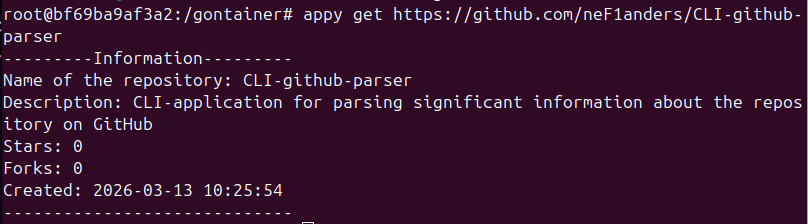

# appy - GitHub Repository Parser CLI

`appy` is a command-line tool that fetches and displays information from a GitHub repository. Given a repository URL, it parses relevant data (such as name, count of forcs, etc.) and prints it to standard output.

## Features

- Retrieve repository information by providing a GitHub URL.
- Simple command structure: `appy get <repository-url>`.
- Fast and lightweight, written in Go.

## Installation

### Prerequisites

- [Go](https://golang.org/dl/) (version 1.16 or later) if you are installing from source.
- A working internet connection to fetch repository data.

1. Clone the repository:
   ```bash
   git clone https://github.com/yourusername/appy.git
   cd appy
   ```

2. Build and install the binary:
   ```bash
   go install
   ```
   This compiles `appy` and places it in your `$GOPATH/bin` directory.  
   **Make sure `$GOPATH/bin` is added to your system's `PATH` environment variable.**

## Building from source 

If you want to modify or contribute to `appy`, you can build the binary manually:

```bash
go build -o appy appy.go
```

Run the tool locally:

```bash
./appy get https://github.com/neF1anders/CLI-github-parser
```
## Usage

The basic command syntax is:

```bash
appy get <github-repository-url>
```

## Example



**Happy parsing!**
